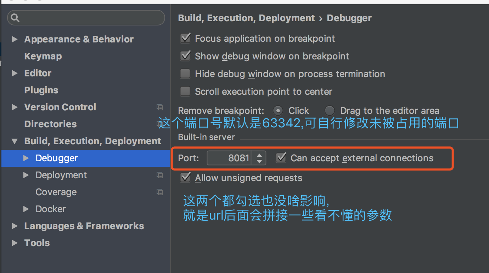
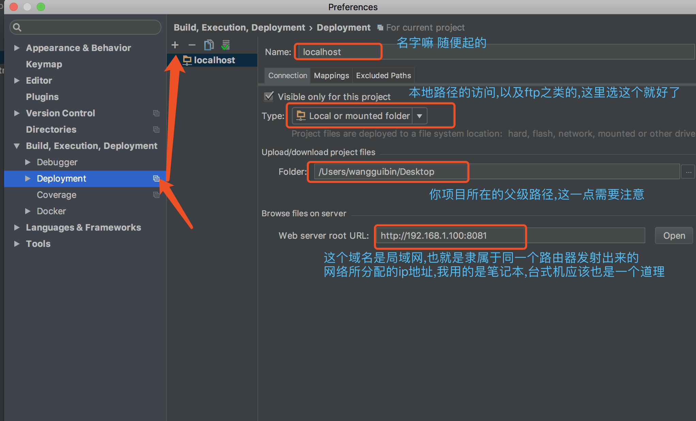
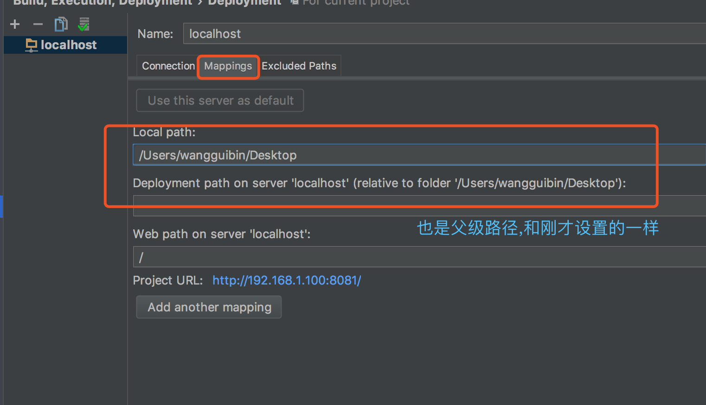

## 1. 做好准备工作

* 安装webstorm以及新建一个项目写个demo
* 确保是同一局域网,同一个路由器下的WiFi或者其他内部网络
* 安装google二维码插件 (草料二维码)

<!-- more -->

## 2. 开始设置

* 用webstorm打开demo,打开偏好设置页面
* 点击到Debugger这一栏,可以看到如图所示:
 
 

* 设置端口号
* ☑️勾选相应设置

## 3. 配置路径

* 点击到Deployment这一栏,如图

* 点击➕号,新建一个,填写自定义名字,设置对应的type
* 设置项目的父级路径
* 设置域名 + 端口号

## 4. 匹配路径设置

* 点击到mapper这一栏,如图

* 设置项目父级路径即可

## 5. 设置完成,即可体验

* 以上全部设置完成后,点击apply,点击ok
* 在项目里点击google浏览器打开即可
* 能够正常打开,点击地址栏旁边草料二维码插件,手机扫码就可以轻轻松松调试了