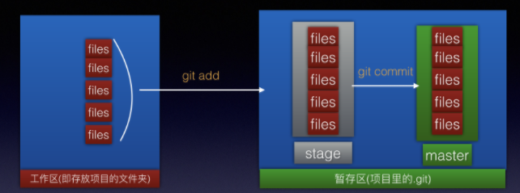

##### 1. 创建版本库
```swift
mkdir gitDemo //创建一个文件夹

pwd //查看当前路径 /Users/wangguibin/Desktop/gitDemo

git init //创建一个版本库
//Initialized empty Git repository in /Users/wangguibin/Desktop/gitDemo/.git/

ls -ah //查看当前目录中的隐藏文件 .git
//.	..	.git

touch readme.txt //创建一个文本
vi readme.txt //修改文本内容

```
<!-- more -->

##### 2. 修改的文件或者创建的新文件提交到版本仓库
```swift
git add  readme.txt //添加到版本库
//一般添加成功不会有任何提示
git commit -m "first update readme file git is 666" // -m 后面的字符串是log日志信息,提交了啥改了啥说明一下,便于管理

提交成功有以下提示信息: 
[master (root-commit) 4acf248] first update readme file git is 666
 1 file changed, 5 insertions(+)
 create mode 100644 readme.txt

(PS.可以一次添加多个文件,一次性提交)
****************************************
$ git add file1.txt
$ git add file2.txt file3.txt
$ git commit -m "add 3 files."
**********************************************
 错误❌示范
 git commit -a "提交readme.txt的最近更新"
fatal: Paths with -a does not make sense.

正确✅姿势
git commit -a -m "提交readme.txt的最近更新"
[master ec855f8] 提交readme.txt的最近更新
 1 file changed, 5 insertions(+)
 
```

##### 3. 查看是否有更改未提交的情况`git status`
```objectivec
git diff readme.txt///查看文件被修改部分内容

///没有更改,没有需要添加提交的地方
git status
On branch master
nothing to commit, working tree clean

///需要添加和提交, 666.txt这个文件被修改了 ,没有提交
git status
On branch master
Changes not staged for commit:
  (use "git add <file>..." to update what will be committed)
  (use "git checkout -- <file>..." to discard changes in working directory)

	modified:   666.txt

no changes added to commit (use "git add" and/or "git commit -a")

///直接提交就好啦,不过这个 "git commit -a"操作也是可以的提交所有 , -m 是message的缩写,后面接一段说明文字
git add 666.txt
git commit -m "修改了666.txt"
[master 1a46406] 修改了666.txt
 1 file changed, 1 insertion(+)
 
git log //查看提交的日志
```
##### 4. 版本回退
```swift
//跳到哪一个版本,秒秒钟的事,切一下头指针就ok,类似于链表的操作
git log --pretty=oneline //查看节点id和提交信息
ec855f8114fced47737b61e8abfaa9fb5949a1ac (HEAD -> master) 提交readme.txt的最近更新
1a46406038a5f50bd48a19daa38c599a6ff92fb6 修改了666.txt
6b064208d5b992866cc1cc21cfd1b416e6b22258 commit 666.txt
4acf24867379120ae1fdfcc9521b0996ad863ae2 first update readme file git is 666

目前HEAD->master指向了"提交最近更新",就是我刚刚提交的
下面那几个越往下,提交的时间越早...
 git reset --hard HEAD^ //回滚上一个版本,回滚到上上个则 HEAD^^,以此类推往回回滚100次则很难数得清楚^的个数可以写成 HEAD~100 这样
git reset --hard commit_id ///提交id不用填写完整,前面几位就可以

git reflog ///查看commit_id和提交历史记录
git reflog
ec855f8 (HEAD -> master) HEAD@{0}: commit: 提交readme.txt的最近更新
1a46406 HEAD@{1}: commit: 修改了666.txt
6b06420 HEAD@{2}: commit: commit 666.txt
4acf248 HEAD@{3}: commit (initial): first update readme file git is 666

```

##### 5. 工作区和暂存区,跟踪修改

**git是如何操作的? 如图,先把修改的文件add到暂存区,然后再执行 git commit,比如有几个文件做了修改,你这个时候可以修改一个就执行add和commit操作,也可以先全部add完再执行一次commit, 建议是开发一个小模块,创建或者修改完就add进去,快下班的时候或者休息的时候翻篇的时候,就执行一次commit操作,不然这个容易忘记,还有模块与模块之间,开发周期与开发周期时间和时机的不同, 尽可能开发一部分就提交一部分,免得积攒大量的任务.. 节点多意味着更加灵活,后续想滚到哪里就滚到哪里...**

##### 6. 撤销修改
```swift
场景1：当你改乱了工作区某个文件的内容，想直接丢弃工作区的修改时，用命令git checkout -- file。

场景2：当你不但改乱了工作区某个文件的内容，还添加到了暂存区时，想丢弃修改，分两步，第一步用命令git reset HEAD file，就回到了场景1，第二步按场景1操作。

场景3：已经提交了不合适的修改到版本库时，想要撤销本次提交，参考版本回退一节，不过前提是没有推送到远程库
```
##### 7.  生成ssh key 
[参考博客](http://blog.csdn.net/makenothing/article/details/8450417)
```swift
//1. 检查是否有ssh key
 cd ~/.ssh 查看这个目录下的文件
 ///2. 生成key
 ssh-keygen -t rsa -C "you email@email.com" 或者去掉 －t rsa
 ///3. 拷贝公钥,设置好对应的key github或者使用的站点
 cat ~/.ssh/id_rsa.pub  查看并拷贝到到git添加设置key
///或者用命令添加到剪贴板
pbcopy < ~/.ssh/id_rsa.pub
///4. 测试一下这个ssh能不能使用
ssh -T git@github.com
```
##### 8.  拉取远程库
```swift
///刻隆下来
///1.cd 到要存储的目录下
///2. 执行 git clone + 链接 
git clone https://github.com/WangGuibin/WGBTagViewDemo.git
////git fetch
git fetch：相当于是从远程获取最新版本到本地，不会自动merge
git fetch origin master
git log -p master..origin/master
git merge origin/master

git fetch origin master:tmp
git diff tmp 
git merge tmp
////git pull
git pull：相当于是从远程获取最新版本并merge到本地
git pull origin master
```
##### 9.  推送到远程库
```swift
git push origin master 
```
[git删除,分支,打tag,拉取和推送远程库参考命令](http://www.cnblogs.com/springbarley/archive/2012/11/03/2752984.html)

#### 分支
```
Git鼓励大量使用分支：

查看分支：git branch

创建分支：git branch <name>

切换分支：git checkout <name>

创建+切换分支：git checkout -b <name>

合并某分支到当前分支：git merge <name>

删除分支：git branch -d <name>

```
### 打tag
```
命令git tag <name>用于新建一个标签，默认为HEAD，也可以指定一个commit id；

git tag -a <tagname> -m "blablabla..."可以指定标签信息；

git tag -s <tagname> -m "blablabla..."可以用PGP签名标签；

命令git tag可以查看所有标签。


命令git push origin <tagname>可以推送一个本地标签；

命令git push origin --tags可以推送全部未推送过的本地标签；

命令git tag -d <tagname>可以删除一个本地标签；

命令git push origin :refs/tags/<tagname>可以删除一个远程标签。


```

### 记录一次实战操作步骤
```apache
// cd Desktop 进入桌面创建一个文件夹
 mkdir WGBGitTest
 cd  WGBGitTest // 进入文件夹
 git init //实例化git
 touch wgb.txt //创建文件,编辑文件,查看文件....
 //添加到暂存区
 git add . 或者 git add wgb.txt
 //提交给git
 git commit -m"logMsg"
 //打上tag
 git tag tagName
 //推送远端
 git push origin tagName
 
 // 开分支 从旧的分支分一个旁路分支进行操作 并切换到子分支进行开发
 git checkout -b  newBranchName
 
 // 切换到子分支进行开发
 git checkout  branchName
 
 // 此时子分支拥有当前master的一切的基础上进行修改,肆意妄为,改动一大波之后,按部就班提交代码到git
 git add XXX  / git commit -m"XXX" 
 
// 希望得到master的认可,master看了代码之后觉得ok,同意接受子分支的代码,于是切换回master分支进行分支合并
git checkout master //回到主分支
git merge --no-ff  branchName //合并子分支 加--no-ff 参数显示提交细节,不加的话相当于跳过子分支的提交细节

// 也可删除子分支
git branch -d branchName

//一波操作
git add XXX /git commit -m"XXXX"
// 打上tag
git tag tagName001
//查看tag
git tag
// 删除tag 
git tag -d tagName commitID
// 查看log信息
git reflog 
// 推送远端
git push origin --tags // 全部未提交的一起上去
 
```

### 常用操作
```
/// 生动形象查看git log
git log --graph 或者
git log --graph --pretty=oneline --abbrev-commit

git add . 或者 git add <filename>

git commit –m "项目描述"

要关联一个远程库，使用命令
git remote add origin git@server-name:path/repo-name.git；

关联后，使用命令git push -u origin master第一次推送master分支的所有内容；

此后，每次本地提交后，只要有必要，就可以使用命令git push origin master推送最新修改；

// 本地分支推送到服务端,并远程建立一个新分支
  git push origin  branchName :branchName
//删除分支
git branch -D branchName (本地)
git push origin  :branchName
// 删除标签
git tag -d tagName
git push origin :refs/tags/tagName
```

### 放弃当前本地修改,强制拉取远程库最新的更新
```swift
git fetch --all
git reset --hard origin/master
git pull //可以省略
```


### `alias | grep git` 调用zsh的插件 git 缩写
`ga` =`git add ` 
`gaa`=`git add --all`
`gb`= `git branch`
`gcam`=`git commit -a -m`
`gcb`= `git checkout -b`
`gco`=`git checkout`
`gm --no-ff `=`git merge --no-ff`
`gcmsg`=`git commit -m`
`gpoat`=`git push origin --all && git push origin --tags`

`gfa` = `git fetch --all --prune`
`grhh`= `git reset HEAD --hard`


 [深入理解分支的重要性](http://blog.jobbole.com/109466/)
 [git命令清单](http://www.ruanyifeng.com/blog/2015/12/git-cheat-sheet.html)


# Debug 遇到的一些各种各样的问题
##### 1.  clone代码的时候遇到如下报错
`fatal: Authentication failed for 'https://gitee.com/iOSCoder-JJMY/JJYSClient.git/'`
*重新设置用户名和邮箱即可*
```
git config --global user.name "wangguibin"
git config --global user.email "wangguibin@jjys168.com"
```

##### 2. 如果你在主分支(master)上做了修改,子分支(dev)想要同步主分支的修改,那么有以下两种操作: 


```
# 方式一: git merge 合并分支
git checkout dev #切换到子分支 
git merge master #合并主分支 即让主分支覆盖子分支 拥有主分支的当前所有更新

# 方式二: git rebase 好像也叫合并分支
git checkout  dev
git rebase master // 将 master 上的修改合并到 dev 分支（当前分支）。
```  
**`rebase` 会将 `dev `上的历史 `commit` 全部修改，并且用新的提交覆盖之。 看起来就是你的 `dev `分支从一个开始就是在最新的 `master` 上开发的( 新的`master`跑到了你分支的最开始处 )**

/// 如果提交信息写错了而提交了可以修改,命令如下(进入vim编辑):
```
git commit --amend 
```


[1. 合并父子分支更新的参考实例](https://segmentfault.com/q/1010000003875183)

[2. merge与rebase的区分和使用](https://www.cnblogs.com/marblemm/p/7161614.html)

[3 .猴子🐒都能懂的Git入门教程之使用用rebase](https://backlog.com/git-tutorial/cn/stepup/stepup2_8.html)

[4. 在开发过程中使用git rebase还是git merge，优缺点分别是什么?](https://www.zhihu.com/question/36509119/answer/131495331)

[5. git rebase & merge 将其他分支的修改合并到当前分支](http://blog.csdn.net/gw569453350game/article/details/52536928)

[6. git常用命令](https://note.leodev.me/2016/01/08/git-commonly-used-commands/)